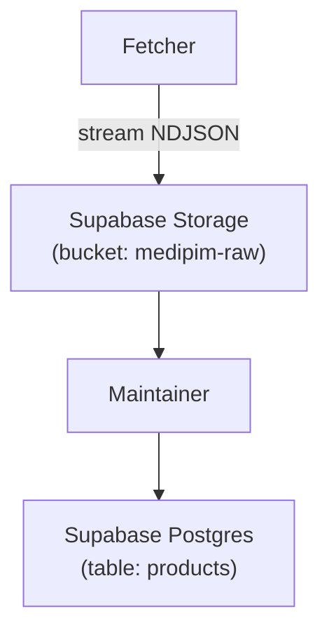

# MediPim AU → Supabase Sync  
*Application Specification (two micro-services on Fly.io)*  

---

## 1 — Goal

* Keep a **Supabase** project in sync with the entire **MediPim Australia** product catalogue.  
* Use two small, long-running Fly.io Machines—one that **downloads** the raw feed and one that **applies** it to the database—without any reliance on time‑limited Edge Functions.

---

## 2 — Micro-services

| Service | Runtime / Host | Primary Job | Triggers & Schedule |
|---------|----------------|------------|---------------------|
| **Fetcher** | Node 20 container → Fly.io **Machine** (`shared-cpu-1x`, 256 MB) | Stream<br>`POST https://api.au.medipim.com/v4/products/stream` → store the NDJSON response as an object in **Supabase Storage** | *Nightly at 01:00 AEST* (15:00 UTC) via Fly Machine cron<br>Manual: `POST /run` endpoint |
| **Maintainer** | Node 20 container → Fly.io **Machine** (`shared-cpu-1x`) | Read the latest raw file → upsert into `products` table – update existing rows when `meta.updatedAt` is newer | *Nightly at 02:00 AEST* (16:00 UTC) via Fly cron<br>Manual: `POST /run` endpoint |

---

## 3 — Data Flow



1. **Fetcher** opens a streaming HTTP POST to MediPim and pipes the bytes directly into a *tus‑resumable* upload.  
2. **Maintainer** grabs the newest file, walks each newline‑delimited JSON object, and:  
   * `INSERT … ON CONFLICT DO UPDATE` where `id` matches **and** `obj.meta.updatedAt` is newer.  
3. Raw files may be purged or kept for audit (configurable).

---

## 4 — External Interfaces

| Endpoint | Method | Purpose | Auth |
|----------|--------|---------|------|
| `/run` (Fetcher) | `POST` | Immediate download of full catalogue | Shared secret header (`X‑ADMIN‑KEY`) |
| `/run` (Maintainer) | `POST` | Immediate reconcile of latest file | Same |
| `/healthz` | `GET` | Liveness probe for Fly & Grafana | Public (`200 OK`) |

---

## 5 — Configuration / Secrets

| Variable | Used by | Description |
|----------|---------|-------------|
| `MEDIPIM_API_KEY` | Fetcher | Bearer token for MediPim AU |
| `SUPABASE_URL` | Both | Project URL |
| `SUPABASE_SERVICE_ROLE_KEY` | Both | Service‑role key (full R/W) |
| `BUCKET` (default `medipim-raw`) | Both | Storage bucket for raw files |
| `ADMIN_KEY` | Both | Simple shared secret for manual `/run` |

All secrets live in **Fly.io Secrets** (`fly secrets set …`).

---

## 6 — Supabase Schema Primitives

```sql
-- Storage bucket (private)
create bucket if not exists medipim_raw;

-- Product table (minimal)
create table if not exists products (
  id          text primary key,
  name        text,
  price_cents integer,
  updated_at  timestamptz default now(),
  raw         jsonb
);
```

---

## 7 — Schedules

| Cron expression (UTC) | Machine | Effect |
|-----------------------|---------|--------|
| `0 15 * * *` | medipim-fetcher | Nightly full download (01:00 AEST) |
| `0 16 * * *` | medipim-maintainer | Nightly reconcile (02:00 AEST) |

---

## 8 — Failure & Recovery Rules

| Scenario | Behaviour |
|----------|-----------|
| **Fetcher interrupted** (machine stop, network fail) | tus resumable upload records offset → next run resumes automatically |
| **Maintainer interrupted** | Upsert is idempotent—rerun is safe (duplicates ignored or updated) |
| **Schema change in MediPim** | Extra JSON keys are stored inside `raw` until migrated |
| **Catalogue grows mid-download** | Fetcher downloads the larger file; Maintainer sees new IDs next night |

---

## 9 — Docs & References

* **MediPim AU stream endpoint** – response schema (`results[]`, `meta.*`):  
  <https://platform.au.medipim.com/docs/api/v4/endpoints/products/query.html#response-body>
* **Fly.io Machines & cron syntax**  
  <https://fly.io/docs/machines/>  
  <https://fly.io/docs/machines/guides/cron/>
* **Supabase Storage resumable uploads (tus)**  
  <https://supabase.com/docs/guides/storage/resumable-uploads>
* **Supabase JavaScript client (`upsert`)**  
  <https://supabase.com/docs/reference/javascript/upsert>

---

## 10 — Cut‑over Checklist

1. **Provision buckets & tables** (`supabase/db/init.sql`).  
2. **Create Fly apps**: `fly launch` inside `/fetcher` and `/maintainer`.  
3. **Set secrets** on both apps (`MEDIPIM_API_KEY`, `SUPABASE_*`, `ADMIN_KEY`).  
4. **Deploy & verify** manual `/run` calls succeed.  
5. **Enable cron schedules** (they live in `fly.toml` → redeploy).  
6. **Set up monitoring**:  
   * Fly checks: `/healthz`  
   * Supabase dashboard: bucket size, function error logs.
